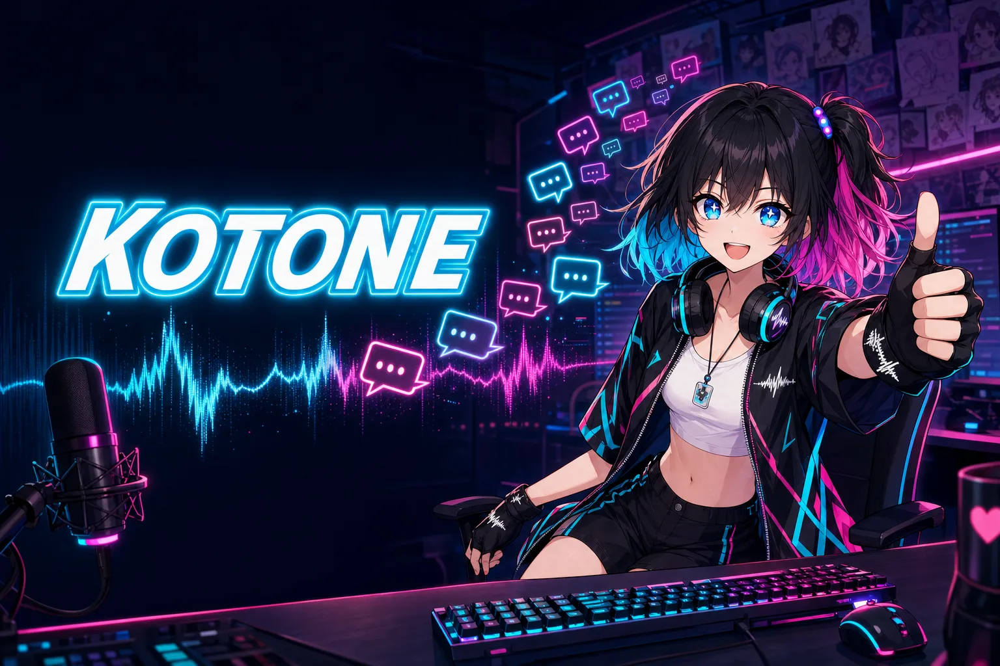
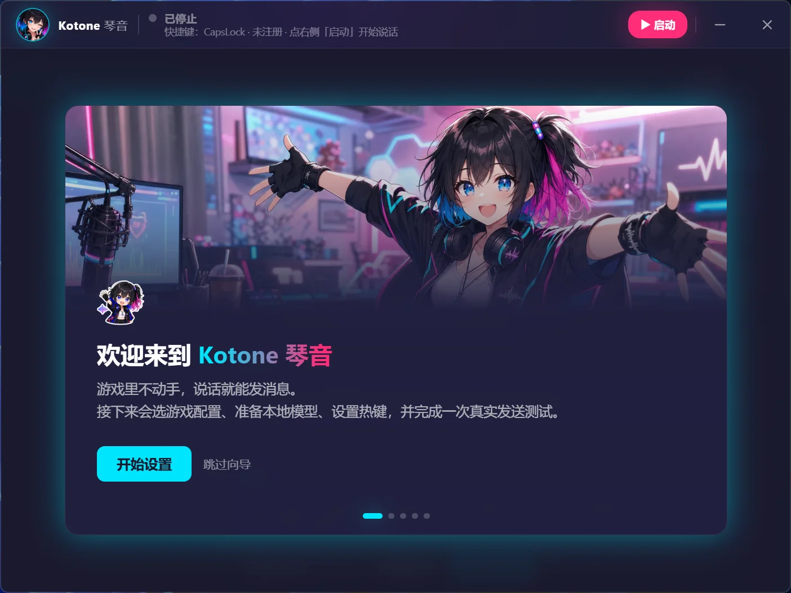
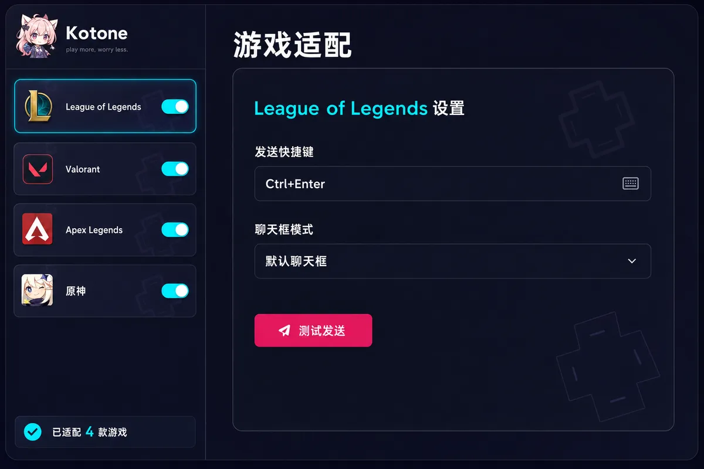
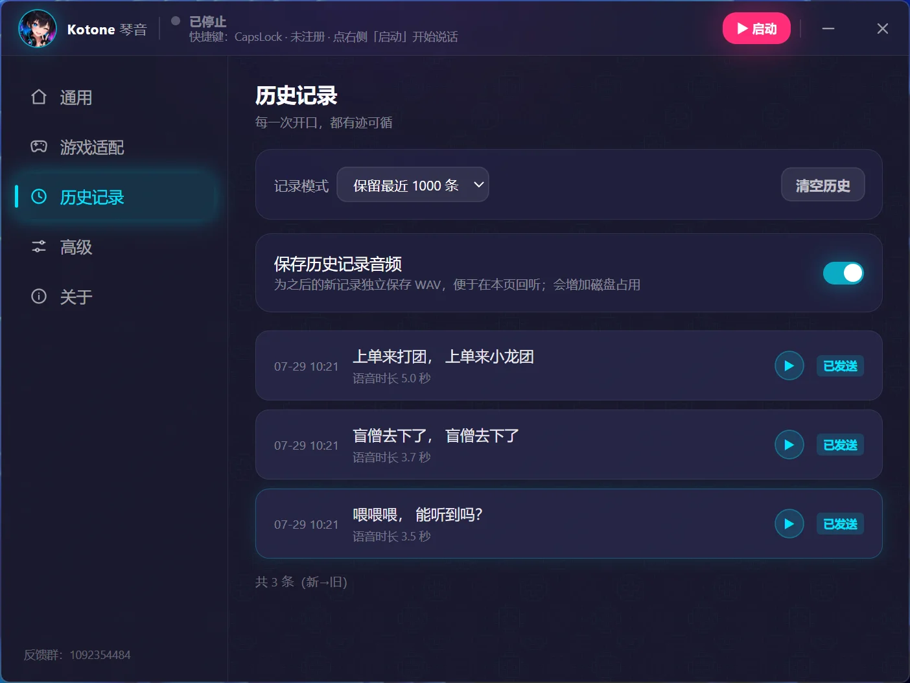
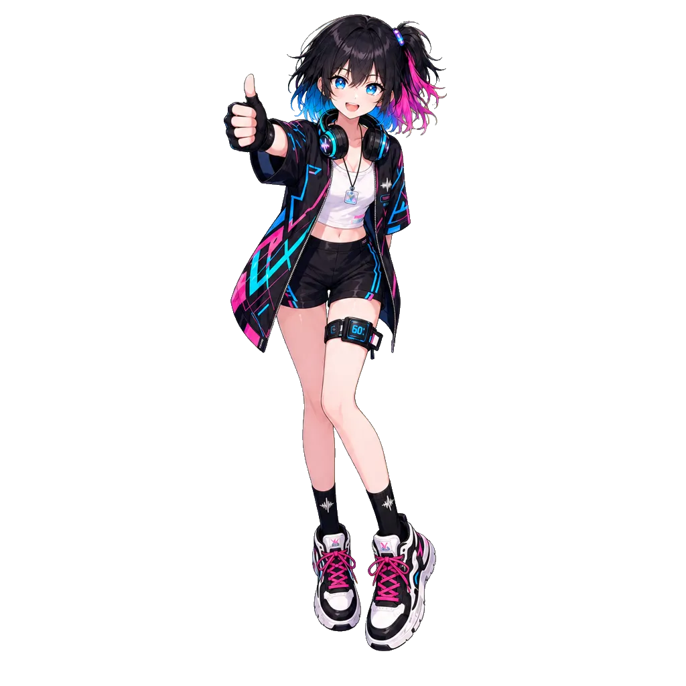
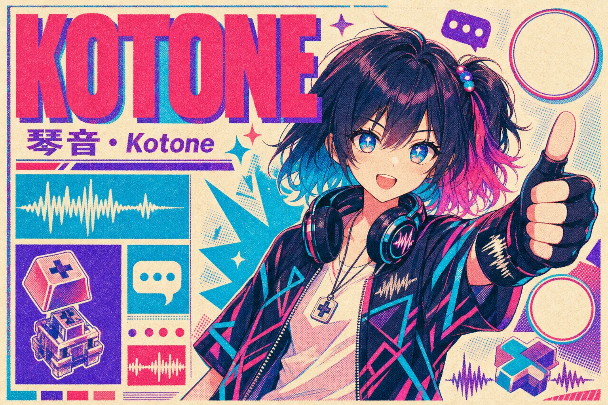

<p align="center">
  
</p>

<h3 align="center">
  <samp>🎤 说话 &nbsp;→&nbsp; ⚡ 成字 &nbsp;→&nbsp; 🎮 发送</samp>
</h3>

<p align="center">
  <samp>手指不离开键盘。想说的话，一秒都别等。</samp>
</p>

<p align="center">
  <a href="https://github.com/l1veIn/kotone/releases"></a>
  
  
  
</p>

<div align="center">

https://github.com/user-attachments/assets/b0b9a55f-9d74-4bdc-ba55-de02883a8d7f

</div>

<p align="center">
  <samp>按住热键说话，松手进游戏聊天框。</samp>
</p>

<p align="center">
  <samp>
    <a href="#-为什么需要-kotone">为什么</a> ·
    <a href="#-三步上手">上手</a> ·
    <a href="#-功能速览">功能</a> ·
    <a href="#-界面">界面</a> ·
    <a href="#-角色卡">角色卡</a> ·
    <a href="#-技术栈">技术栈</a> ·
    <a href="#-开发">开发</a> ·
    <a href="#-鸣谢">鸣谢</a>
  </samp>
</p>

## 🥊 为什么需要 Kotone

<table>
  <tr>
    <td width="50%">
      <h4>😰 以前的你</h4>
      <sub>打团打到一半，队友 ping 你报点。<br>你停下操作 → 打开聊天框 → 打字 → 回车。<br>抬起头，你的角色已经站在原地三秒了。</sub>
    </td>
    <td width="50%">
      <h4>😎 现在的你</h4>
      <sub>按住热键，说一句「打野在下路」。<br>松开热键，文字已经发送。<br>你的手指，从头到尾没离开过键盘。</sub>
    </td>
  </tr>
</table>

<br>

**Kotone** 是一款专为游戏玩家打造的 Windows 桌面语音输入工具：按住热键说话，语音在**本机**实时流式转成文字，松开热键一键送进游戏聊天框。识别全程本地完成，录音不出你的电脑。

> <i>“想说的话，一秒都别等。”</i> — 琴音

<br>

## 🚀 三步上手

<p align="center">
  <table>
    <tr>
      <td align="center" width="33%">
        <samp>STEP 01</samp>
        <h3>📥 装</h3>
        <sub>从 <a href="https://github.com/l1veIn/kotone/releases">Releases</a> 下载 <code>Kotone_*_x64-setup.exe</code><br>支持 Windows 10 / 11（x64）<br>安装器自带简体中文界面</sub>
      </td>
      <td align="center" width="33%">
        <samp>STEP 02</samp>
        <h3>🧭 配</h3>
        <sub>首次启动向导一条龙：<br>选「英雄联盟」或「通用输入」<br>→ 下载本地模型 → 设热键 → 真实发送测试</sub>
      </td>
      <td align="center" width="33%">
        <samp>STEP 03</samp>
        <h3>🎤 说</h3>
        <sub>之后的一切交给热键。<br>内置自动更新，<br>新版本发布自动提醒。</sub>
      </td>
    </tr>
  </table>
</p>

> 暂未接入 Windows 代码签名，系统可能显示 SmartScreen 提示。请只从本仓库的 GitHub Release 下载，并核对 Release 中公布的 SHA-256。

<br>

## ✨ 功能速览

- 🎤 **流式语音转写** — 默认 X-ASR 中英标点模型，边说边出字；识别全程在本机完成，VAD 判停组件已打包进应用本体，随启动自动就绪。
- ⌨️ **全局热键** — 按住说话 / 点按切换两种模式，任意键自定义；提示驻留期内再按热键，直接开始下一句。
- 🎮 **游戏术语热词** — 内置 100 个英雄联盟术语热词；版本更新的新词条自动并入，你的自定义与删除永不丢失。
- 🌙 **电竞悬浮窗** — 卡片 / 胶囊两种样式，整面可拖动并记忆位置，鼠标点击穿透；流式引擎实时出字，非流式引擎显示声波动画。
- 🕘 **历史与回放** — 每条识别记录可回放原始音频，带声波动画；空转录不误发送、不留痕。
- 🔒 **本地优先** — 模型全部本机运行，不上传任何录音；托盘常驻、自动更新、管理员权限一键重启。

<br>

## 📸 界面

<table>
  <tr>
    <td width="50%" align="center">
      
      <br>
      <samp>🚀 首次启动向导</samp>
    </td>
    <td width="50%" align="center">
      
      <br>
      <samp>🎤 通用设置</samp>
    </td>
  </tr>
  <tr>
    <td width="50%" align="center">
      
      <br>
      <samp>⚙️ 游戏适配设置</samp>
    </td>
    <td width="50%" align="center">
      
      <br>
      <samp>🕘 历史记录与回放</samp>
    </td>
  </tr>
</table>

<br>

## 🔧 技术栈

<p align="center">
  
  
  
  
  
</p>

<samp>

- **Desktop** — Tauri 2 + Rust workspace：`kotone-core`（会话编排 / 配置 / 历史）、`kotone-stt`（引擎抽象 + sherpa-onnx）、`kotone-platform-windows`（热键 / 注入 / 提权）、`kotone-cli`（无 Tauri 命令行前端，见 [`docs/cli.md`](docs/cli.md)）
- **Voice** — sherpa-onnx · X-ASR 流式模型 · Silero VAD，全部本地运行
- **UI** — Svelte 5 + Tailwind CSS，深色电竞主题

</samp>

<br>

## 📂 仓库结构

```
apps/desktop            Tauri 桌面应用（Svelte 5 前端 + Rust 后端）
crates/kotone-core      会话编排、配置、历史、profile 的领域核心
crates/kotone-stt       语音识别引擎抽象与 sherpa-onnx 实现
crates/kotone-platform-windows  全局热键、窗口注入、提权等 Windows 平台能力
crates/kotone-cli       命令行前端（自动化测试与无人值守入口）
docs/                   ADR、CLI 参考、发布检查单、评测手册
```

<br>

## 🚀 开发

<details open>
<summary><b>快速开始</b></summary>

```bash
git clone https://github.com/l1veIn/kotone.git
cd kotone
pnpm install --frozen-lockfile
pnpm dev          # 需要 Rust 与 Windows C++ Build Tools
```

</details>

<details>
<summary><b>质量门禁与构建</b></summary>

```bash
pnpm check
pnpm -C apps/desktop test:e2e
cargo test --workspace --locked
pnpm build        # NSIS 安装包输出到 target/release/bundle/nsis/
```

发布检查项见 [`docs/release-checklist.md`](docs/release-checklist.md)。

</details>

隐私与第三方模型信息见 [`PRIVACY.md`](PRIVACY.md) 和 [`THIRD_PARTY_NOTICES.md`](THIRD_PARTY_NOTICES.md)，变更历史见 [`CHANGELOG.md`](CHANGELOG.md)。

<br>

---

<br>

## 🎭 角色卡

<table>
  <tr>
    <td width="34%" align="center">
      
    </td>
    <td width="66%">
      <h3>琴音 · Kotone <sub>ことね</sub></h3>
      <p>
        <samp>AGE&nbsp;&nbsp;&nbsp;&nbsp;18</samp><br>
        <samp>JOB&nbsp;&nbsp;&nbsp;&nbsp;游戏主播 —「打字比打游戏快」</samp><br>
        <samp>FANS&nbsp;&nbsp;&nbsp;键盘侠（她起的，说要亲手平反）</samp><br>
        <samp>BASE&nbsp;&nbsp;&nbsp;中继站 · 被 RGB 霓虹和粉丝手写信包围的直播间</samp><br>
        <samp>MOTTO&nbsp;&nbsp;想说的话，一秒都别等</samp>
      </p>
      <p>观众来看她打游戏，留下来看她边打团边秒回弹幕——弹幕说她是<b>「人形语音输入法」</b>。她曾尝试用语音输入回弹幕，结果「谢谢老板」被识别成「谢谢老伴」，那面贴满翻车记录的「社死墙」至今还在直播间里。</p>
      <p><samp>「收到，已发送！✨」</samp></p>
    </td>
  </tr>
</table>


<p align="center">
  
  
  
  
</p>

<br>

## 🙏 鸣谢

Kotone 站在许多优秀开源项目与模型的肩膀上。特别感谢：

| 项目 | 角色 |
| --- | --- |
| [**sherpa-onnx**](https://github.com/k2-fsa/sherpa-onnx) | 本地语音推理运行时与 Rust 绑定，流式 / 非流式引擎的基础设施 |
| [**X-ASR**](https://huggingface.co/GilgameshWind/X-ASR-zh-en) | 默认中英流式标点模型（Zipformer2 transducer），边说边出字的核心 |
| [**FunASR**](https://github.com/modelscope/FunASR) | 中文 ASR 工业级生态；SenseVoice、FunASR-Nano 等模型的上游 |
| [**SenseVoice**](https://github.com/FunAudioLLM/SenseVoice) | 可选多语非流式识别模型（中英日韩粤等） |
| [**FunASR-Nano**](https://github.com/modelscope/FunASR) · [ONNX 导出](https://github.com/Wasser1462/FunASR-nano-onnx) | 可选高质量非流式档位 |
| [**Silero VAD**](https://github.com/snakers4/silero-vad) | 语音活动检测，一句话判停与端点切分 |
| [**LeagueAkari**](https://github.com/LeagueAkari/LeagueAkari) | 英雄联盟游戏内文本注入与发送流程的参考实现 |
| [**Tauri**](https://github.com/tauri-apps/tauri) · [**Svelte**](https://github.com/sveltejs/svelte) | 桌面壳与前端框架 |
| [**RepoChan**](https://github.com/l1veIn/repochan-mono) | 人设 / 视觉 / 品牌资产流水线（分析 → 人设 → 艺术指导 → 画师 → 页面） |

许可证与模型归属细节见 [`THIRD_PARTY_NOTICES.md`](THIRD_PARTY_NOTICES.md)。若有遗漏，欢迎提 PR 补全。

<br>

---

<br>

<p align="center">
  
</p>

<p align="center">
  <samp>品牌由 <a href="https://github.com/l1veIn/repochan-mono"><b>RepoChan</b></a> 人设流水线一站式产出 — 分析 → 人设 → 艺术指导 → 画师 → 页面</samp>
  <br>
  <samp>made with 💖 by RepoChan</samp>
</p>
