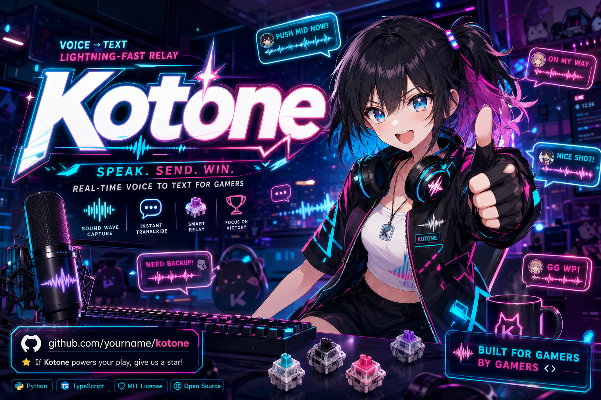
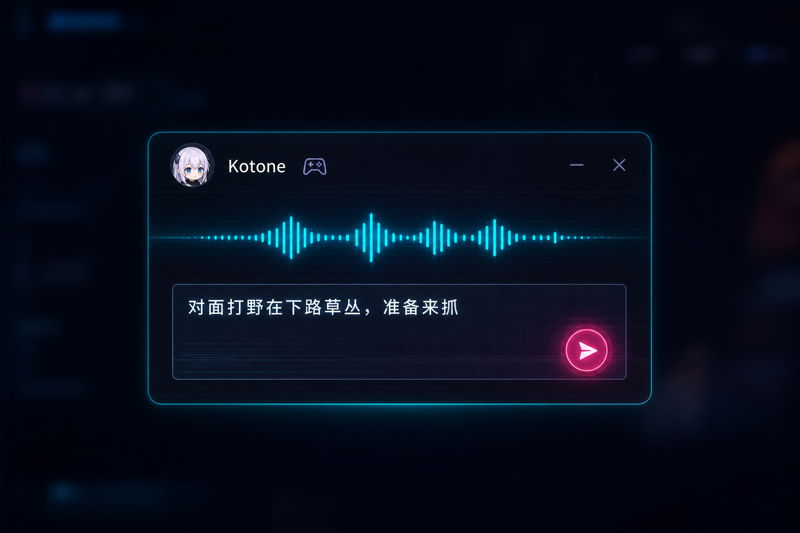
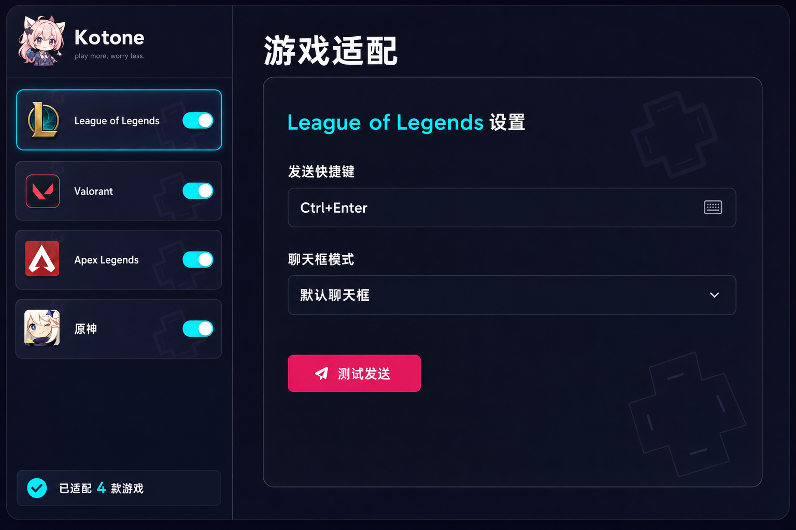
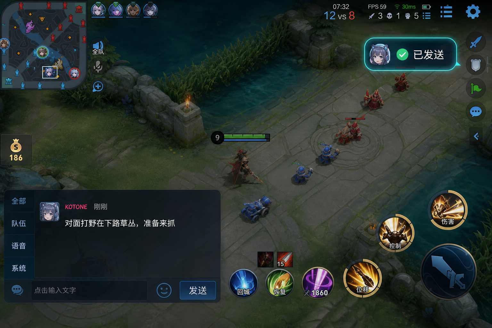
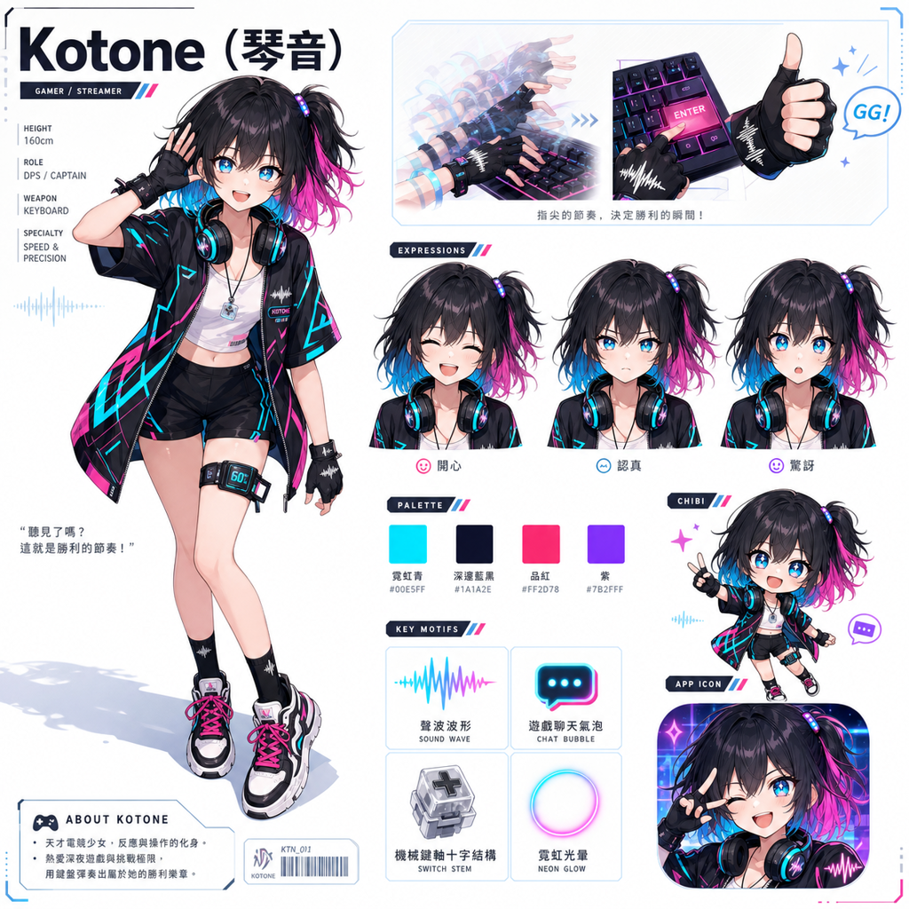
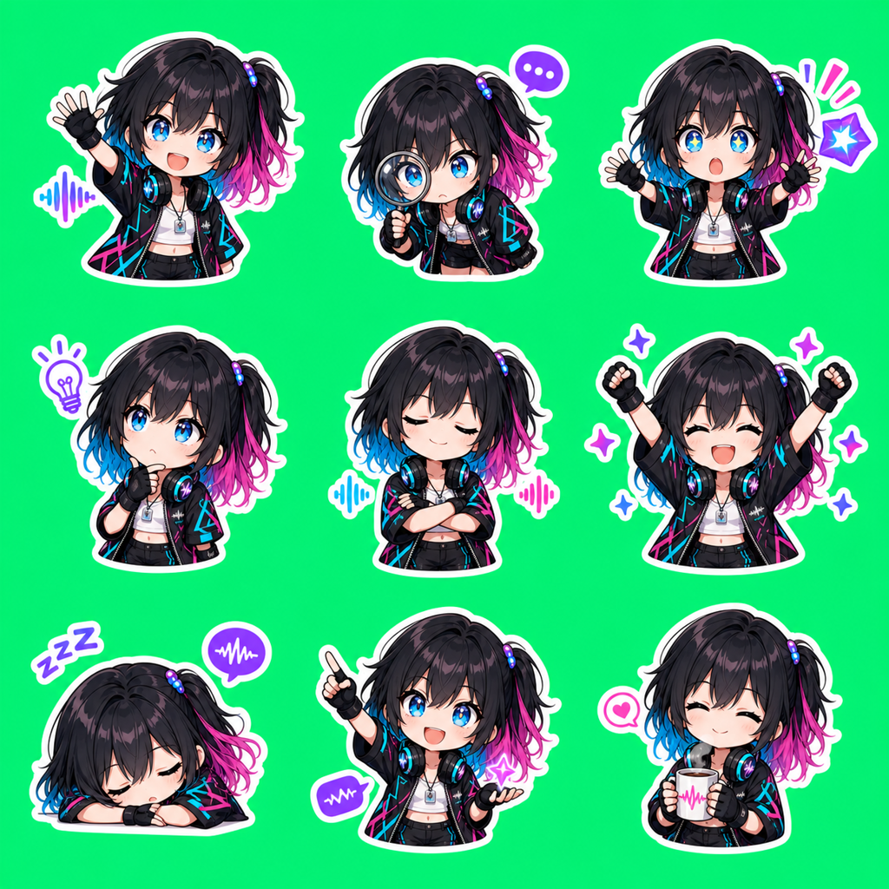
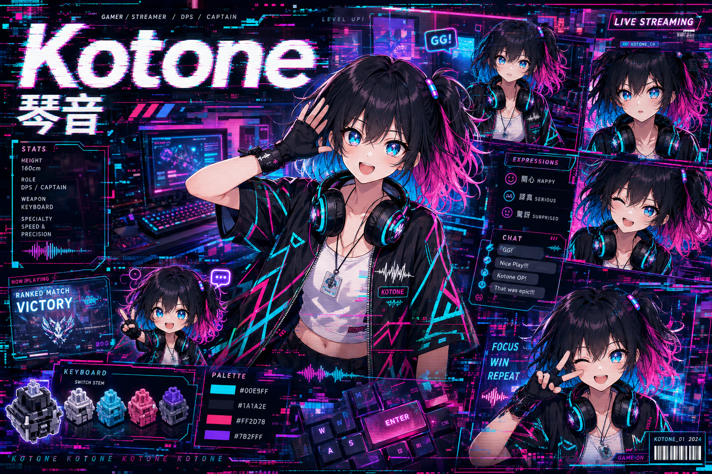

<p align="center">
  <picture>
    
  </picture>
</p>

<p align="center">
  <samp>
    <a href="#-what-is-kotone">About</a> ·
    <a href="#-features">Features</a> ·
    <a href="#-screenshots">Screenshots</a> ·
    <a href="#-the-mascot">Mascot</a> ·
    <a href="#-tech-stack">Tech Stack</a>
  </samp>
</p>

<br>

<h3 align="center">
  <samp>🎤 voice → ⚡ text → 🎮 game chat</samp>
</h3>

<p align="center">
  <samp>说你想说的。剩下的交给琴音。</samp>
</p>

<br>

---

## 🎮 What is Kotone?

**Kotone** 是一个专为游戏玩家打造的桌面语音输入工具。

你在打团、对线、操作角色——这时队友需要你报点。现有方案要求你停下来、打开聊天框、打字、回车——整个过程你的角色站着不动。**Kotone 让你的手指不离开键盘**：说出的话实时转成文字，一键发送到游戏聊天框。

> *“想说的话，一秒都别等。”* — 琴音

<br>

<p align="center">
  <table>
    <tr>
      <td align="center" width="33%">
        <samp>🎤 VOICE</samp><br>
        <sub>实时语音识别<br>边说边转</sub>
      </td>
      <td align="center" width="33%">
        <samp>⚡ INSTANT</samp><br>
        <sub>话音未落字已出<br>200+ WPM</sub>
      </td>
      <td align="center" width="33%">
        <samp>🎮 GAME-READY</samp><br>
        <sub>一键发送到游戏<br>不中断操作</sub>
      </td>
    </tr>
  </table>
</p>

<br>

## ✨ Features

```
┌─────────────────────────────────────────────────┐
│  🎤  实时语音转文字                               │
│     说出的话瞬间变成聊天框里的文字                    │
│                                                  │
│  ⚡  一键发送到游戏                                │
│     适配 LOL · Valorant · Apex · 原神 等           │
│                                                  │
│  ⌨️  快捷键绑定                                    │
│     自定义发送快捷键，配合你的操作习惯                 │
│                                                  │
│  🎮  多游戏配置                                    │
│     每款游戏独立配置，自动切换                       │
│                                                  │
│  🌙  深色电竞UI                                   │
│     悬浮窗设计，不遮挡游戏画面                       │
│                                                  │
│  🖥️  跨平台                                       │
│     Windows · macOS · Linux                      │
└─────────────────────────────────────────────────┘
```

<br>

## 📱 Screenshots

<p align="center">
  <picture>
    
  </picture>
</p>

<p align="center">
  <samp>🎤 语音输入悬浮窗 — 说出的话实时转成文字，一键发送</samp>
</p>

<br>

<p align="center">
  <picture>
    
  </picture>
</p>

<p align="center">
  <samp>⚙️ 游戏适配设置 — 多游戏独立配置，快捷键自定义</samp>
</p>

<br>

<p align="center">
  <picture>
    
  </picture>
</p>

<p align="center">
  <samp>✅ 发送成功 — 消息直达游戏聊天框，操作不中断</samp>
</p>

<br>

---

## 🎭 The Mascot

<p align="center">
  <picture>
    
  </picture>
</p>

<blockquote align="center">
  <p>
    <b>琴音 · Kotone</b><br>
    <sub>18岁 · 游戏主播 · 打字比打游戏快</sub>
  </p>
</blockquote>

<p align="center">
  <samp>「收到，已发送！✨」</samp>
</p>

琴音是 Kotone 的品牌灵魂——一个以超快打字速度闻名的游戏主播。她的观众来看她打游戏，留下来看她边打团边秒回弹幕。弹幕说她是**「人形语音输入法」**。

她曾是游戏网吧里帮客人打字传话的女孩，现在运营着**「中继站」**——一间被 RGB 霓虹灯和粉丝手写信包围的城市公寓直播间。

<br>

<p align="center">
  <picture>
    
  </picture>
</p>

<p align="center">
  <samp>😄 3×3 表情贴纸包 — 社媒 · 聊天 · 直播间</samp>
</p>

<br>

<p align="center">
  <picture>
    
  </picture>
</p>

<br>

| 🎨 | 色值 | 用途 |
|---|---|---|
| 霓虹青 | `#00E5FF` | 主色调 · 交互高亮 |
| 深邃蓝黑 | `#1A1A2E` | 背景 · 暗色主题 |
| 品红能量 | `#FF2D78` | 强调 · 行动按钮 |
| 紫电 | `#7B2FFF` | 点缀 · 层级区分 |

<br>

---

## 🔧 Tech Stack

<p align="center">
  <samp>
    <b>Desktop</b> &nbsp; Tauri / Electron &nbsp;·&nbsp;
    <b>Voice</b> &nbsp; Whisper / Web Speech API &nbsp;·&nbsp;
    <b>UI</b> &nbsp; React / Svelte &nbsp;·&nbsp;
    <b>Design</b> &nbsp; Cel-shaded + Neon Pop
  </samp>
</p>

<br>

---

## 🚀 Getting Started

```bash
# 克隆仓库
git clone https://github.com/your-username/kotone.git
cd kotone

# 安装依赖
pnpm install

# 启动开发模式
pnpm dev

# 构建生产版本
pnpm build
```

<br>

---

## 📖 品牌故事

Kotone 的品牌由 **[RepoChan](https://github.com/l1veIn/repochan-mono)** 人设流水线一站式产出：

| 环节 | 产出 |
|---|---|
| 🕵️ 分析师 | 项目信号提取 → 品牌定位报告 |
| 🎭 创意团队 | Kotone 角色人设 · 世界观 · 性格 |
| 🎬 艺术指导 | 7 份资产订单（基础设定页 / 表情 / 海报 / 横幅 / 纹理） |
| 🎨 画师 | 10 张视觉资产 · AI 图像生成 |
| 🌐 页面设计 | 双语网站 · Astro Starter 组装 |

<br>

<p align="center">
  <picture>
    
  </picture>
</p>

<p align="center">
  <samp>
    made with 💖 by RepoChan &nbsp;·&nbsp;
    <a href="https://github.com/l1veIn/repochan-mono">source</a>
  </samp>
</p>
